# MySQL学习笔记

---

* **Author** 	`MilkLoo`
* **Email**        2395611610@qq.com
* **Github**     https://github.com/MilkLoo 

---

## 关系型数据库设计原则

```
1.表 记录  字段

2.表的关联关系

(1) 一对一关系
(2) 一对多关系
(3) 多对多关系
(4) 自我引用
```

---

## SQL

* **`SQL` 分类**

```sql
# DDL: 数据定义语言。 CREAT  \  ALTER  \  DROP  \  RENAME  \ TRUNCATE

# DML: 数据操作语言。 INSERT  \ DELETE  \ UPDATE \ SELECT (重中之重)

# DCL: 数据控制语言。 COMMIT  \ ROLLBACK  \ SAVEPOINT \ GRANT \ REVOKE

# 学习技巧：大处着眼、小处着手。
```

* **`SQL` 语句规则与规范**

```sql
# 1.SQL可以写在一行或者多行。为了提高可读性，各子句分行写，必要时使用缩进。

# 2.每条命令以; 或者\g 或 \G 结束

# 3.关键字不饿能被缩进也不能分行

# 4.关于标点符号 （1）必须保证所有的()、单引号、双引号是成对结束的
#			  (2) 必须使用英文状态下的半角输入方式
#			 （3）字符串类型和日期时间的数据可以用单引号表示
#			 （4）列的别名，尽量使用双引号,不建议省略as
			 
# 5.推荐数据库名，表名，表的别名，字段名，字段别名用小写，SQL关键字，函数名，绑定变量等都大写。
```

* **`SQL` 导入现有的数据表、表的数据**

```mysql
# 导入现有的数据表

source # 文件路径
```

---

## 基本的SELECT语句

```mysql
SELECT 1; #没有任何子句
SELECT 1 + 1, 3 * 2 FROM DUAL; # dual:伪表

# SELECT 字段名 FROM 表名 
SELECT employee_id,last_name,salary FROM employess;
# * 表示所有字段
SELECT * FROM employess;
# 列（字段）的别名   as：全称   alias（别名）可以省略
# 列的别名可以用一对双引号引起来
# "annual sal"  必须用的场景
SELECT employee_id emp_id,last_name AS lname, department_id "部门id" salary * 12 "annual sal" FROM employess;

# 去除重复行 
SELECT DISTINCT department FROM employess;

# 空值参与运算: 结果一定也为空  解决办法 引入 IFNULL
# 1. 空值 NULL
# 2. null 不等同于 0  '', 'null'

SELECT employee_id,salary "月工资"，salary * (1 + IFNULL(commission_pct,0)) * 12 "annual sal", commission_pct FROM employess;

# 着重号 `` 当表明与一些保留字有重名，可以用这个符号

SELECT * FROM `ORDER`;

# 查询常数
SELECT '尚硅谷'，123，employee_id，salary FROM employess;

# 显示表结构  表名
DESCRIBE employess; # 显示表中字段的详细信息
DESC employess;

# 过滤数据  过滤条件 WHERE 声明在 FROM 结构的后面
SELECT * FROM employess WHERE department_id = 90;
SELECT * FROM employess WHERE last_name = 'King';
```

---

## 运算符算式运算符

- **算式运算符**

``````mysql
# +  -  *  /div  %mod
SELECT 100,100+0,100-0,100+50-30,100+35.5,100-35.5 FROM DUAL;

SELECT 100 + '1' FROM DUAL; # 会将字符串转为数值
SELECT 100 + 'a' FROM DUAL; # 此时将 'a' 当作 0 处理
SELECT 100 + NULL FROM DUAL; # NULL作运算，结果为NULL

# 分母如果为0 结果为NULL
SELECT 100,100*1,100*1.0,100/1.0,100/2,100+2*5/2,100/3,100 DIV 0 FROM DUAL;

SELECT 12 % 3, 12 % 5, 12 MOD -5, -12 % 5, -12 % -5 FROM DUAL;
``````

* **比较运算符**

```mysql
# 1. =   <=>  <>   !=   <  <=  >  >=

# = 的使用
SELECT 1 = 2, 1 != 2, 1 = '1',1 = 'a', 0 = 'a' FROM DUAL; # 字符串存在隐式转换，如果转换数值不成功，则看作0
SELECT 'a' = 'a','ab' = 'ab','a' = 'a' FROM DUAL; # 两边都是字符串的，则按照ANSI的比较规则进行比较
SELECT 1 = NULL, NULL = NULL FROM DUAL; # 只要有null参与判断，结果都为NULL

SELECT * FROM employess WHERE salary = 6000;
SELECT * FROM employess WHERE last_name = NULL; #此时执行，不会有任何结果

# <=> 安全等于   记忆技巧   为NULL而生
SELECT 1 <=> 2, 1 <=> '1',1 <=> 'a', 0 <=> 'a' FROM DUAL;
SELECT 1 <=> NULL, NULL <=> NULL FROM DUAL;  #前者 0   后者 1

# <>  != 不等于
SELECT  2<>3, '4' <> NULL, '' != NULL,NULL != NULL FROM DUAL;

# IS NULL \ IS NOT NULL \ ISNULL

SELECT * FROM employess WHERE last_name IS NULL;
SELECT * FROM employess WHERE last_name IS NOT NULL;
SELECT * FROM employess WHERE ISNULL(last_name);
SELECT * FROM employess WHERE NOT last_name <=> NULL;

# LEAST() \ GREATEST  最小  最大
SELECT LEAST('g','b','t','m'),GREATEST('g','b','t','m') FROM DUAL;
SELECT LEAST(first_name,last_name) FROM employees;

# BETWEEN ... AND
SELECT employee_id,last_name,salary FROM employees WHERE salary BETWEEN 6000 AND 8000;
SELECT employee_id,last_name,salary FROM employees WHERE salary >= 6000 && salary <= 8000;
SELECT employee_id,last_name,salary FROM employees WHERE salary NOT BETWEEN 6000 AND 8000;

# IN (SET) \ NOT IN (SET)
SELECT last_name,salary,department_id FROM employees WHERE department_id = 10 OR department_id = 20 OR department_id = 30;
SELECT last_name,salary,department_id FROM employees WHERE department_id IN (10,20,30);
SELECT last_name,salary,department_id FROM employees WHERE salary NOT IN (6000,7000,8000);

# LIKE  模糊查询
# % 表示不确定个数的字符  （0个  1个  或 多个）
SELECT last_name,salary,department_id FROM employees WHERE last_name LIKE '%a%';
# 以a开头
SELECT last_name,salary,department_id FROM employees WHERE last_name LIKE 'a%';
# 包含a和e
SELECT last_name,salary,department_id FROM employees WHERE last_name LIKE '%a%' AND last_name LIKE '%e%';
SELECT last_name,salary,department_id FROM employees WHERE last_name LIKE '%a%e%' OR last_name LIKE '%e%a%';

#第二个字符是a
# _ 代表一个不确定的字符
SELECT last_name FROM employees WHERE last_name LIKE '_a%';

# 第二个字符是_且第三个字符是a的
# 使用转义字符 \
SELECT last_name FROM employees WHERE last_name LIKE '_\_a%';

# REGEXP \ RLIKE  正则表达式 
SELECT 'shkstart' REGEXP '^s','shkstart' REGEXP 't$','shkstart' REGEXP 'hk' FROM DUAL;
```

* **逻辑运算符**

```mysql
# OR ||   AND &&   NOT !   XOR   
SELECT last_name,salary,department_id FROM employees WHERE department_id = 10 AND department_id = 20;

SELECT last_name,salary,department_id FROM employees WHERE department_id = 10 XOR salary > 6000;
# AND 的优先级 大于 OR
```

* **位运算符**

```mysql
# & | ^ ~ >> <<
SELECT 12 ^ 5 , 12 | 5 , 12 & 5 FROM DUAL;
```

* **例子**

```mysql
SELECT last_name, salary FROM employees WHERE salary < 5000 OR salary > 12000;
SELECT last_name, department_id FROM employees WHERE department_id = 20 OR department_id = 50;
SELECT last_name, job_id,manager_id FROM employees WHERE manager_id IS NULL;
SELECT last_name, job_id,manager_id FROM employees WHERE manager_id <=> NULL;
SELECT last_name, salary，commission_pct FROM employees WHERE commission_pct IS NOT NULL;
SELECT last_name, salary，commission_pct FROM employees WHERE commission_pct <=> NULL;
SELECT last_name FROM employees WHERE last_name LIKE '__a%';
SELECT last_name FROM employees WHERE last_name LIKE '%a%k%' OR LIKE '%k%a%';
SELECT last_name FROM employees WHERE last_name LIKE '%a%' AND LIKE '%k%';
```

---

## 排序与分页

* **排序数据**

```sql
# 如果没有使用排序操作，默认情况下查询返回的数据是按照添加数据的顺序显示的。
SELECT * FROM employees;

# 使用 ORDER BY 对查询的数据（不一定是查询的字段）进行排序操作  默认按照升序排序
# 升序  ASC  (ascend)
# 降序  DESC (descend)
SELECT employee_id,last_name,slary FROM employees ORDER BY salary ASC;
SELECT employee_id,last_name,slary FROM employees ORDER BY salary DESC;

# 列的别名只能在 ORDER BY 使用，不能在 WHERE 使用
SELECT employee_id,last_name,slary * 12 annual_sal FROM employees ORDER BY annual_sal ASC;

# 强调格式 ：WHERE 需要声明在 FROM 之后 ， ORDER BY 之前
SELECT employee_id,slary FROM employees WHERE department_id IN (50,60,70) ORDER BY department_id ASC;

# 二级排序
SELECT employee_id,slary FROM employees WHERE department_id IN (50,60,70) ORDER BY department_id ASC，salary DESC;
```

* **分页**

```mysql
# mysql 使用 limit 实现数据的分页显示
# 第一页
SELECT employee_id,last_name FROM employees LIMIT 0, 20;
# 第二页
SELECT employee_id,last_name FROM employees LIMIT 20, 20;
# 第三页
SELECT employee_id,last_name FROM employees LIMIT 40, 20;
# 每页显示pageSize条记录，此时显示第pageNo页
# 公式：LIMIT （pagesNo - 1） * pageSize, pageSize;

# WHERE ... ORDER BY ... LIMIT 声明顺序如下；
# 结构 “LIMIT 0, 条目数” 等价于 “LIMIT 条目数”
SELECT employee_id,last_name,slary FROM employees WHERE salary > 6000 ORDER BY salary DESC LIMIT 10;

SELECT employee_id,last_name,slary FROM employees LIMIT 31，2;

# MySQL8.0 新特性   LIMIT ... OFFSET ...
SELECT employee_id,last_name,slary FROM employees LIMIT 2 OFFSET 31;

# 约束返回结果的数量可以减少数据表的网络传输量，也可以提升查询效率
SELECT employee_id,last_name,slary FROM employees ORDER BY salary DESC LIMIT 0, 1;

SELECT last_name,department_id,slary * 12 annual_salary FROM employees ORDER BY annual_salary DESC, last_name ASC;

SELECT last_name,salary FROM employees WHERE salary NOT BETWEEN 8000 AND 17000 ORDER BY salary DESC LIMIT 20,20;

SELECT employee_id, last_name, department_id FROM employees WHERE email LIKE '%e%' ORDER BY LENGTH(email) DESC, department_id; 
```

---

## 多表查询

* `SQL JOIN`



```mysql
# 出现笛卡尔积的错误，错误的原因是缺少了多表的链接条件

# 两个表的链接条件
SELECT employee_id,department_name FROM employees,departments WHERE employees.`department_id` = departments.department_id;

# 如果查询语句中出现了多个表中都存在的字段，则必须知名此字段所在的表。
# 建议：从sql优化的角度，建议多表查询时，每个字段都指明其所在的表。
SELECT employees.employee_id, departments.department_name，employees.department_id FROM employees,departments WHERE employees.`department_id` = departments.department_id;

# 可以给表起别名， 在SELECT 和 WHERE 中使用表的别名
# 如果给表起了别名，一旦在 SELECT 或 WHERE 中使用表名的话，则必须使用表的别名，而不能再使用表原名。
SELECT emp.employee_id, dept.department_name，emp.department_id FROM employees emp,departments dept WHERE emp.`department_id` = dept.department_id;

# 如果有 N 个表实现多表的查询，则需要至少 N-1 个链接条件 
SELECT e.employee_id, e.last_name, d.department_name, l.city FROM employees e,departments d, location l WHERE e.`department_id` = d.`department_id` AND d.`location_id` = l.`location_id`;

# 多表查询的分类
/*
	角度1：等值连接  vs  非等值连接
	
	角度2：自连接    vs  非自连接
	
	角度3：内连接    vs  外连接
*/

# 等值连接   vs  非等值连接
# 非等值连接
SELECT e.last_name, e.salary, j.grade_level FROM employees e, job_grades j WHERE e.`salary` BETWEEN j.`lowest_sal` AND j.`highest_sal`;

# 自连接  vs  非自连接
SELECT emp.employee_id, emp.last_name, mgr.employee_id, mgr.last_name FROM employees emp, employees mgr WHERE emp.`manager_id` = mgr.`employee_id`; 

# 内连接   vs   外连接
# 内连接：合并具有同一列的两个以上的表的行，结果集 中不包含一个表与另一个表不匹配的行
SELECT employee_id,department_name FROM employees e,departments d WHERE e.`department_id` = d.`department_id`;
# 外连接：合并具有同一列的两个以上的表的行，结果集 中除了包含一个表与另一个表不匹配的行之外，还查询到了左表或右表中不匹配的行。
# 分类：左外连接、右外连接、满外连接。
# 左外连接：两个表在连接过程中除了返回满足连接条件的行以外还返回左表中不满足条件的行，称为左外连接
# 右外连接：两个表在连接过程中除了返回满足连接条件的行以外还返回右表中不满足条件的行，称为右外连接

# 使用 JOIN ... ON 的方式实现  多表查询。这种方式也能解决外连接问题

# 内连接
SELECT employee_id,department_name FROM employees e INNER JOIN departments d ON e.`department_id` = d.`department_id`;

SELECT e.employee_id, e.last_name, d.department_name, l.city FROM employees e INNER JOIN departments d ON e.`department_id` = d.`department_id` INNER JOIN location l ON d.`location_id` = l.`location_id`;

# 查询 所有的 员工的last_name,department_name信息
# 左外连接
SELECT e.last_name, d.department_name FROM employees e LEFT OUTER JOIN departments d ON e.`department_id` = d.`department_id`;  
# 右外连接
SELECT e.last_name, d.department_name FROM employees e RIGHT OUTER JOIN departments d ON e.`department_id` = d.`department_id`;  
# 满外连接

```

>* **<font color=red>[强制]</font>  超过三个表禁止join。需要join的字段，数据类型保持绝对一致；多表关联查询时，保证被关联的字段需要有索引。**
>
>* **我们要控制连接表的数量。多表连接就相当于嵌套for一样，非常消耗资源**。

* **`UNION` 的使用**	

```mysql
# UNION 和 UOION ALL 的使用
# UNION: 会执行去重操作
# UOION ALL : 不会执行去重操作
# 结论：如果明确知道合并数据后的结果数据不存在重复数据，或者不需要去除重复数据。则尽量使用UNION ALL语句，以提高数据查询的效率。


```

* `NATUAL` **自然连接**

```mysql
# NAYUAL JOIN 用来表示自然连接
# 会自动帮你查询两张连接表中 所有相同的字段，然后进行等值连接
```

* `USING` **的使用**

```mysql
# 简化JOIN ON 的等值连接
# 使用场景 具有相同的字段名称
# 只能和JOIN一起使用
```

---

## 单行函数

* **数值函数**

| 函数                   | 用法                                                         |
| :--------------------- | ------------------------------------------------------------ |
| ABS(X)                 | 返回X的绝对值                                                |
| SIGN(X)                | 返回X的符号。正数返回1，负数返回-1，0返回0                   |
| PI()                   | 返回圆周率的值                                               |
| CELI(X) , CEILING(X)   | 返回大于或等于某个值的最小整数                               |
| FLOOR(X)               | 返回小于或等于某个值的最大整数                               |
| LEAST(E1,E2,E3,...)    | 返回列表中的最小值                                           |
| GREATEST(E1,E2,E3,...) | 返回列表中的最大值                                           |
| MOD(X,Y)               | 返回X除以Y后的余数                                           |
| RAND()                 | 返回0-1的随机值                                              |
| RAND(X)                | 返回0-1的随机值，其中x的值用作种子值，相同的x值会产生相同的随机数 |
| ROUND(X)               | 返回一个对x的值进行四舍五入后，最接近于X的整数               |
| ROUND(X,Y)             | 返回一个对x的值进行四舍五入后，最接近于X的整数,并保留到小数点后面Y位 |
| TRUNCATE(X,Y)          | 返回数字x截断为y位小数的结果                                 |
| SQRT(X)                | 返回x的平方根。当x的值为负数时，返回NULL                     |

* **角度与弧度互换函数**

| 函数       | 用法                                  |
| ---------- | ------------------------------------- |
| RADIANS(X) | 将角度转化为弧度，其中，参数x为角度值 |
| DEGREES(X) | 将弧度转换为角度，其中，参数x为弧度值 |

* **三角函数**

| 函数       | 用法                                                         |
| ---------- | ------------------------------------------------------------ |
| SIN(X)     | 返回x的正弦值，其中，参数x为弧度值                           |
| ASIN(X)    | 返回x的反正弦值，即获取正弦为x的值，如果x的值不在-1到1之间，则返回NULL |
| COS(X)     | 返回x的余弦值，其中，参数x为弧度值                           |
| ACOS(X)    | 返回x的反余弦值，即获取余弦为x的值，如果x的值不在-1到1之间，则返回NULL |
| TAN(X)     | 返回x的正切值，其中，参数x为弧度值                           |
| ATAN(X)    | 返回x的反正切值，即获取正切为x的值                           |
| ATAN2(M,N) | 返回两个参数的反正切值                                       |
| COT(X)     | 返回x的余切值，其中，x为弧度值                               |

* **字符串函数**

> **<font color=red>NOTE:</font>** 字符串的索引是从 **1** 开始的。

| 函数                           | 用法                                                         |
| ------------------------------ | ------------------------------------------------------------ |
| ASCII(S)                       | 返回字符串s中的第一个字符的ASCII码值                         |
| CHAR_LENGTH(S)                 | 返回字符串s的字符数。作用与CHARACTER_LENGTH(S)相同           |
| LENGTH(S)                      | 返回字符串s的字节数，和字符集有关                            |
| CONCAT(S1,S2,...,SN)           | 连接s1,s2,...,sn为一个字符串                                 |
| CONCAT_WS(X,S1,S2,S3,...,SN)   | 同CONCAT(s1,s2,...)函数，但是每个字符之间要加上x             |
| INSERT(STR,IDX,LEN,REPLACESTR) | 将字符串str从第idx位置开始，len个字符长的子串替换为字符串replacestr |
| REPLACE(STR,A,B)               | 用字符串b替换字符串str中所有出现的字符串a                    |
| UPPER(S) 或 UCASE(S)           | 将字符串s的所有字母转成大写字母                              |
| LOWER(S) 或 LACSE(S)           | 将字符串s的所有字母转成小写字母                              |
| LEFT(STR,N)                    | 返回字符串str最左边的n个字符                                 |
| RIGHT(STR,N)                   | 返回字符串str最右边的n个字符                                 |
| LPAD(STR,LEN,PAD)              | 用字符串pad对str最左边进行填充，直到str的长度为len个字符     |
| RPAD(STR,LEN,PAD)              | 用字符串pad对str最右边进行填充，直到str的长度为len个字符     |
| LTRIM(S)                       | 去掉字符串s左侧的空格 |
| RTRIM(S)                       | 去掉字符串s右侧的空格 |
| TRIM(S)                        | 去掉字符串s开始与结尾的空格 |
| TRIM(S1 FROM S)                | 去掉字符串s开始与结尾的s1                                    |
| TRIM(LEADING S1 FROM S)        | 去掉字符串s开始处的s1 |
| TRIM(TRAILING S1 FROM S)       | 去掉字符串s结尾处的s1 |
| REPEAT(STR,N)                  | 返回str重复n次的结果 |
| SPACE(N)                       | 返回n个空格 |
|STRCMP(S1,S2)| 比较字符串s1，s2的ASCII码值的大小 |
| SUBSTR(S,INDEX,LEN) | 返回从字符串s的index位置其len个字符，作用与SUBSTRING(S,N,LEN)、MID(S,N,LEN)相同 |
| LOCATE(SUBSTR,STR) | 返回字符串substr在字符串str中首次出现的位置，作用于POSITION(substr IN str)、INSTR(str,substr)相同，未找到，返回0 |
| ELT(M,S1,S2,...,SN) | 返回指定位置的字符串，如果m=1，则返回s1，如果m=2，则返回m=n，则返回sn |
| FIELD(S,S1,S2,...,S3) | 返回字符串s在字符串列表中第一次出现的位置 |
| FIND_IN_SET(S1,S2) | 返回字符串s1在字符串s2中出现的位置。其中，字符串s2是一个以逗号分隔的字符串 |
| REVERSE(S) | 返回s反转后的字符串 |
| NULLIF(VALUE1,VALUE2) | 比较两个字符串，如果value1和value2相等，则返回NULL，否则返回value1 |

```mysql
# CONCAT使用场景
SELECT CONCAT(emp.last_name,'worked for',mgr.laste_name) FROM employees emp JOIN employees mgr ON emp.`manager_id` = mgr.`employee_id`;
# LPAD实现右对齐效果
# RPAD实现左对齐效果
```

* **日期与时间函数**

| 函数                                                         | 用法                           |
| ------------------------------------------------------------ | ------------------------------ |
| **<font color=red>CURDATE()</font>**,CURRENT_DATE()          | 返回当前日期，只包含年、月、日 |
| **<font color=red>CURTIME()</font>**,CURRENT_TIME()          | 返回当前时间，只包含时，分，秒 |
| **<font color=red>NOW()</font>** / SYSDATA()/ CURRENT_TIMESTAMP() / LOCALTIME() / LOCALTIMESTAMP() | 返回当前系统日期和时间         |
| UTC_DATE()                                                   | 返回UTC时间                    |
|                                                              |                                |
|                                                              |                                |
|                                                              |                                |
|                                                              |                                |
|                                                              |                                |
|                                                              |                                |
|                                                              |                                |
|                                                              |                                |
|                                                              |                                |
|                                                              |                                |
|                                                              |                                |

